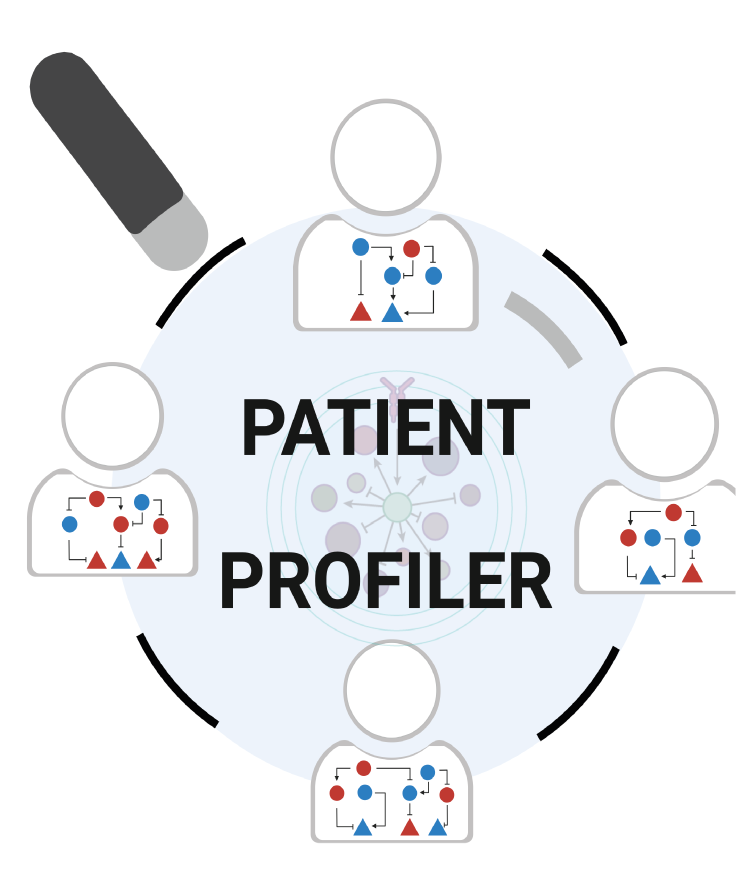

# PatientProfiler 

## Overview

## Installation

To install PatientProfiler execute the following command in R.

``` r
devtools::install_github('https://github.com/SaccoPerfettoLab/PatientProfiler/')
```

PatientProfiler is currently under active development, as such we suggest to delete and re-install the package regularly to exploit the new features.

## Prerequisites

PatientProfiler is dependent on Saez lab algorithm CARNIVAL for performing the signalling pathway optimization. You can find all the instructions for installation in Saez lab repository [CARNIVAL](https://saezlab.github.io/CARNIVAL/).

## Tutorial

The first tutorial of PatientProfiler is available [here](https://html-preview.github.io/?url=https://github.com/SaccoPerfettoLab/PatientProfiler/blob/main/vignette/PatientProfiler-vignette.html)

If you haven't data, try PatientProfiler using pre-harmonized multiomic data from CPTAC portal. 
The tutorial for the usage is [here](https://html-preview.github.io/?url=https://github.com/SaccoPerfettoLab/PatientProfiler/blob/main/vignette/Access_CPTAC_vignette.html).

## Citation

If you use PatientProfiler in your research please cite the [preprint](https://www.biorxiv.org/content/10.1101/2025.01.31.635886v1).

> PatientProfiler: A network-based approach to personalized medicine Veronica Lombardi, Lorenzo Di Rocco, Eleonora Meo, Veronica Venafra, Elena Di Nisio, Valerio Perticaroli, Mihail Lorentz Nicolaeasa, Chiara Cencioni, Francesco Spallotta, Rodolfo Negri, Francesca Sacco, Livia Perfetto bioRxiv 2025.01.31.635886; doi: <https://doi.org/10.1101/2025.01.31.635886>
